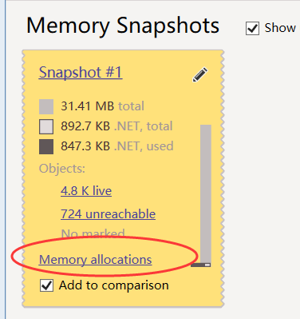
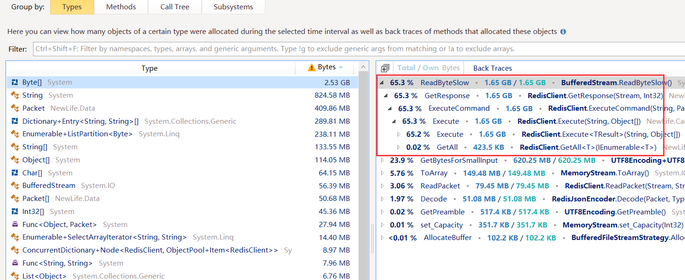
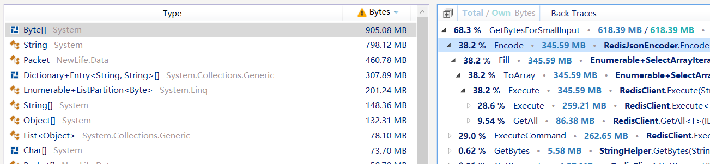

# dotMemory分析Redis的GC分配

​	NewLife组件进入v11时代，重点是减少内存GC。NewLife.Redis作为第一站试用，目标是Redis指令收发过程中，减少内存分配，降低GC。

​	本文对基础要求很高，假定你熟悉dotMemory并阅读过NewLife.Redis源代码。

## 改进前分析

​	Test测试项目改为Test2，启用Bench压测。该压测会执行数百万次Redis操作，可以观测到大量GC。

​	直接查看内存分配：

​	得知内存分配最多的是这里：

​	由此得知，我们需要优化GetResponse，让它使用内存池。当然，在那之前，我们先关闭缓冲流BufferedStream。

## 去掉缓冲流

​	去掉缓冲流，再次测试。Byte[]的内存分配竟然从2.53G下降到905M，看样子它的设计并不好。

